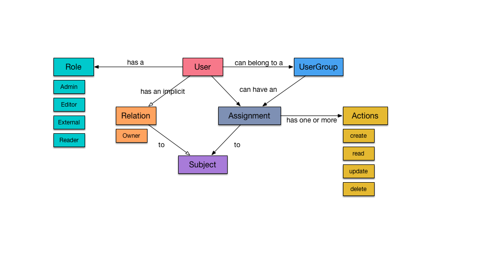
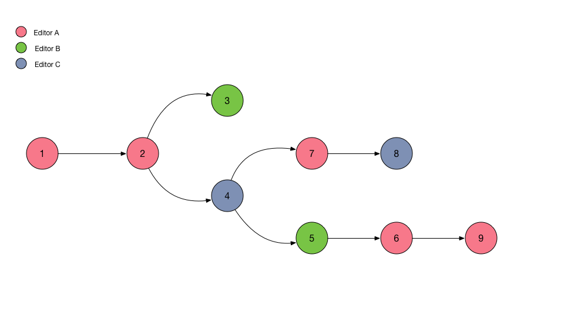
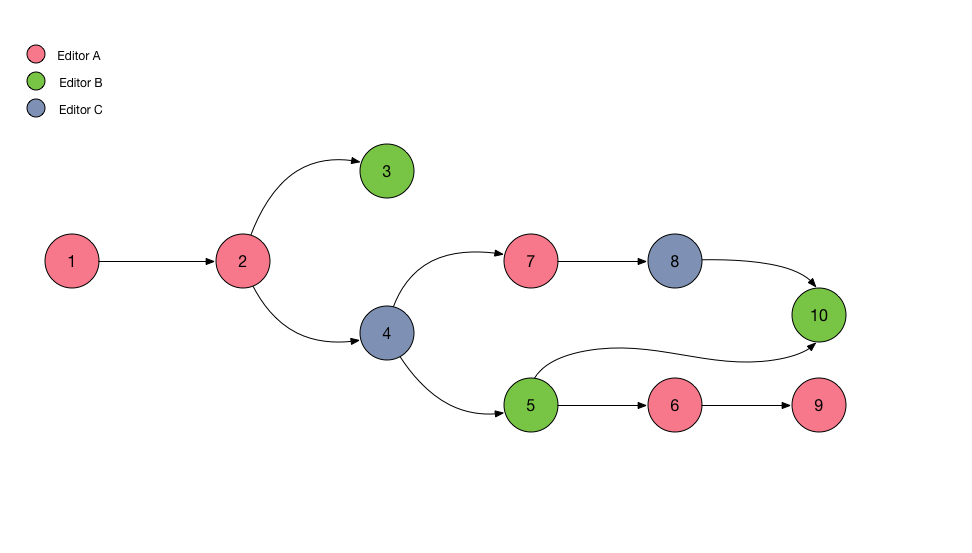
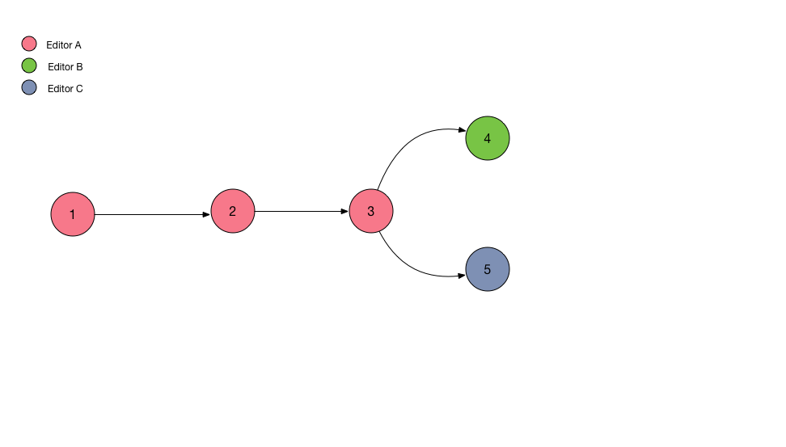
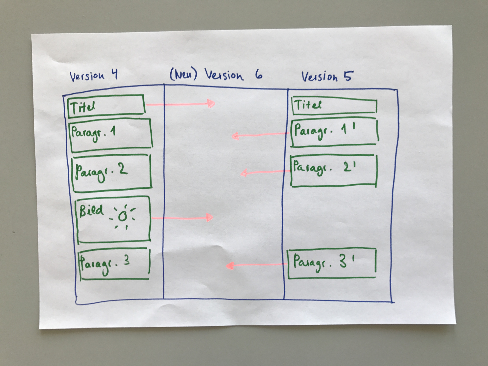

# What we intend to build

Here we describe how we intend our CMS to work for it's users. To better illustrate some abstract concepts, we will often use the case of the production of a newsletter - because we already have gained some experience with newsletter production at Project R - to make the abstract more concrete.

---

The newsletter example will be between such grey lines

---

## Authorization \(who has access to what\)

Here we describe under which circumstances a user has the right to see and/or modify a document.

Each user has one and only one out of four **roles** \(the higher role always includes all the rights of the lower role\):

| Role | Who will have this role | What can they do |
| --- | --- | --- |
| Admin | cvd, ...? | can do everything |
| Editor | all the members of the in-house editorial staff | can create own documents and read and modify all the documents that are "in the system" |
| External | freelancers: journalists, correctors, experts... | create own documents |
| Reader | the rest of the world | nothing |

Additionally to this roles we want owners of documents to be able to grant people access to specific documents. This is important for everybody with the role "external", as they do by default only see the documents they have created themselves another example is an investigative document that must only be seen by certain eyes. We distinguish between read and write access \(in one case they can only see what's there and maybe write comments or so in the other case they can modify the document\).

**Groups**: To make life a little bit easier we can create groups of users and then grant access to a document to a group. For example all correctors could be in one group, and then they could all be given access to documents that should be corrected.

And here's a schema of all that:

If the subject is a document we'd like to have the following rules in place:

### Create

Everybody with a valid login \(every role except "Reader"\) to the CMS can actually create a document.

### Read

You can read a document, if:

* Your relation to the subject is "Owner".
* Your role is "Admin" or "Editor".
* You're assigned to the subject with a "Read" permission.
* You belong to a user group that is assigned to the subject with a "Read" permission.

### Update

You can update a document, if:

* Your relation to the subject is "Owner".
* Your role is "Admin" or "Editor".
* You're assigned to the subject with an "Update" permission.
* You belong to a user group that is assigned to the subject with an "Update" permission.

### Delete

You can delete a document, if:

* Your role is "Admin".

---

In our newsletter example we have five people:

* Constantin is the author with the role "editor"
* Christof is another author with the role "editor"
* Andrea is the cvd with the role "admin"
* Laurent is the AD with the role "external"
* Kurt is the corrector with the role "external"

---

## Create one document

The **document**: This is the technical term for an article \(and it is not exactly the same thing, but that is irrelevant here\).

The most important concept around documents are **blocks** \(out of which documents are made\), another important concept are **templates**, they enforce some rules \(for example every article needs one and only one title\) and styling \(for example the format love-letter could have some hearts after each paragraph\). Then there is **meta information** about a document \(like a Facebook share-image\) and we have the concept of **folders**, where other files can be stored in the same place as the documents.

### Blocks

A document is a collection of blocks. Blocks can be pure text blocks with some rules and styling. For example a title is only text, with a restriction on its length and it is going to be displayed with a bigger font and other title specific styling. Or a lead is another pure text block with other restrictions and other styling than the title. The most profane block is the paragraph. Then there can be more sophisticated text blocks, such as an ordered list \(1. 2. 3. ...\). Then we can have composed blocks, such as an image, which can consist of only an image or an image with a caption. A Vimeo embed is also a block and so is the two-click-vote. There is an infinity of possible blocks and the list will always be evolving and never finished.

Users can choose existing, empty blocks and fill them with text, links, images etc. They can change the order of the blocks and add and delete blocks as they like.

---

For newsletters we have so far used the following blocks:

Header

* An image URL
* A caption text

Title

* Text, the title's content

Lead

* Text, the lead's content

Paragraph

* Text, the p's content

Ordered List

* List of text blocks

Unordered List

* List of text blocks

Image

* An image URL
* An alternative text (for screen readers)
* A caption text

Video

* A video URL / embed script
* A caption text

With these components in place we should be perfectly able to create and produce a newsletter document.

---

Note: We will have the technical possibility to publish stories, for which we do not have defined abstract blocks. For example, if we would have been working with this CMS during the campaign but would beforehand only have defined the blocks we need for a newsletter, we still could have published the [formally complicated story "Wer sind Sie"](https://www.republik.ch/updates/wer-sind-sie) and even used the CMS for the text parts without going the extra mile of abstracting the advanced scrollytelling blocks. Still, if we need this layout more than once or twice we can put it into a block and journalists can play around with it without having to talk to developers \(but maybe they better should do it anyway\). This is important, because only like this fast prototyping of new formats is possible.

### Templates

If we look at the newsletters that we've published, we see some structural patterns that hold for all newsletters:

* They all have and start with a Header.
* There's always a Title following the Header.
* Sometimes there's a Lead, but if there is, it comes straight after the title.
* The rest of the newsletter consists of a custom combination of Paragraphs, Lists, Images and Videos.

With this, we can actually formulate some very basic rules that every newsletter document has to live up to. We call this ruleset a Template. And we can do that for any type of article: the interview, the love-letter or just the standard article.

A Template holds always three different kind of information:

* A list of component types, that can be used in a document.
* A list of rules describing mandatory components and their position in the component list.
* Specific layout and styling directives

---

With this in mind, let's write a newsletter Template.

Allowed Components:
Header, Title, Lead, Paragraph, Ordered List, Unordered List, Image and Video

Document Structure:

* Mandatory component
* Mandatory position

* Header \*+

* Title \*+
* Lead +
* ...
* ...
* Free combination of Paragraph, Ordered List, Unordered List, Image and Video

Styling:
Our branding, fonts, colors, etc.

---

So, ultimately a document consists of a list of components and gets structurally controlled by the assigned template.

### Meta Information

Additionally to the blocks, we can add meta-information to the document. For example we have to declare who will be displayed as author\(s\). Or we need to specify which share-image we want for social media. We could add some tags and so on...

---

For our newsletter, we need the following meta-information:

* Title
* Slug, a readable but URL-compatible identifier, e.g. "Über die Unfreiheit des Willens" becomes "ueber-die-unfreiheit-des-willens".
* Social media image
* Social media title
* Social media description

---

### Folders

In the process of creating a story, potentially many secondary files are used. This may be a list of links, the transcript of an interview, the audio-file of an interview, fotos, custom layout code etc.

We think it is nice, when these files can be stored in the same place where the story-document itself is and therefore are shared with the people also working on this story. This can be seen as an integrated dropbox.

## Collaborating on documents

Here we explain, how we want to handle different persons working in the same document \(still independently from a concrete production workflow, which we will explain in the next section\).

We think of the creation process of an article in the following phases:
1. ideas, research, discussion
2. working on the content \(authors writing\)
3. produce the content \(correctors etc.\)
4. after publication \(update, publish to other channels, handle reader comments etc.\)

### Three possibilities

There are basically three different ways to handle multiple authors working on the same document:

* pure serial: only one person at a time can manipulate a document
* live collaboration: like Google Docs
* branching & merging: several persons can edit versions and declare new versions of a document. If two or more persons edit the same version and make a new version, we have a tree of versions \(this mechanism is called "branching" - like the branches of a tree\). One can make a new version out of two existing versions taking parts from both of them \(this is called "merging"\).

Spoiler: after comparing these possibilities we'll conclude that for us "branching & merging" is at the moment the way to go and after that we'll really explain how it works - so don't worry, if you don't get it yet.

* Live collaboration and branching & merging both only add possibilities over pure serial. So the easiest way to go would be pure serial. And we think that it would be ok, so whatever we choose, we can always decide to reduce it to pure serial. But this has a huge problem: two people can never edit the same document concurrently. We think that collaboration is really important and want to do more.

* Live collaboration and branching & merging do not exclude each other. But because both are complex concepts that are going to need a lot of attention in order to work properly and have a good UX, we want to choose one and start with this and then maybe later \(like not 2017\) extend to the other.

* Concentration: with branching & merging one is working on a personal version, so there is no distraction while working by other people who may work at the same time in the same document \(unlike live collaboration\). While in the process of writing, writers need to focus and not be confronted with other real time changes.

* Control: with branching & merging one has always complete control over one's own version - it is impossible that someone destroys something someone else has written \(and not like in Google Docs where you have to do tedious searching for history in order to restore something\). So authors have less reasons not to share something with other people and higher incentives to collaborate.

* Real time awareness of changes: With live collaboration one always knows when something is changing, this gives a good control and situational awareness of what's going on.

We see more advantages of branching & merging than with live collaboration. The main advantage of live collaboration is the situational awareness that it brings us by displaying to all collaborators instantaneously all the changes. We can partially incorporate this advantage into the branching and merging tool, not by showing the actual changes other people are making live, but by showing on a meta-level who is working right now on which version \(so collaborators are given important information, and can react appropriately\).

Now let's explain in detail how branching and merging works before we think about how this is useful in the different phases of the creation of an article.

### Branching and merging

Imaging a scenario like this: somebody proofreading our article and correcting typos and the likes as she goes. While she is doing that, you too give our piece another thorough read and find some inconsistencies that you immediately want to set straight. Aw snap, we have a situation here.

That being said, there are in fact a lot of more constructive scenarios that imply two or more editors working on the same document \(let's say inserting images while proofreading the text\). Collaboration is ultimately a thing that we want to support, enable and encourage people to practise.

The idea behind the collaboration process that we want to develop is very much inspired by version control systems as used in software development such as Git.

It works like this:

We create a new document. The new and empty document stands for the very first version of this document. Now, for every change that we want to persist, we create a new version. Example:

* Version A is an empty document.
* Version B is a document containing a title stub.
* Version C is a document containing a title stub and a couple of paragraphs.

Once a new version is made - to use version control terminology, **committed** -, it is effectively immutable.

You can save \(or the software will do it for you automatically\) the state of what you are currently working on, it is not going to be lost. And of course you can undo and redo as long as the editor is open. But only when you declare a new version or when you **commit**, it will be a version you can later/always go back to.

You will never be able to actually change a version or commit. What you can \(and will\) do though is create a new version that is derived from and references an existing one. I could for example take Version B, add some images and **commit** it. Now our version list looks like this:

* Version A is an empty document.
* Version B \(from Version A\) is a document containing a title stub.
* Version C \(from Version B\) is a document containing a title stub and a couple of paragraphs.
* Version D \(from Version B\) is a document containing a title stub and a couple of images.

A little more extensive graph of such a process could look something like this:

The numbers represent the chronological order in which the versions were created.

As you can see, one really just picks a version from a point in time and takes it from there with zero risk of messing up anybody else's work.

If we stopped here, our definition of collaboration would simply imply that we have some kind of history and that we reduced the risk of affect our colleagues's work to zero. While this is already very useful, it's not really collaboration, is it?

Enter the merge process. We want to be able to reference two or more versions and merge them into a new one. There's no magic to that, you'll manually choose the blocks from any of the selected versions and transfer them into a new single version.

Let's take the graph from above and add a little bit of merging.

Here we see, that Editor B merged the contents of versions 5 and 7 into version 10. Again, 5 and 7 did not get modified at all.

To illustrate the merge-process, let's look at an example. Let's say we are under time pressure before a publication. The author handed in the text, all is fine with it now we need to produce it and first two things that need to happen are:

* the corrector needs to correct the article
* the art-directer needs to adds some images

Look at this graph. The version that the writer handed in is version 3. Then the corrector corrects and when he is finished, he makes a new version \(or to use the new vocabulary **commit**\) which is number 4. A the same time, the art director is trying out different images at different positions and when she is satisfied, she too makes a new commit, Nr. 5.

Now the cvd \(or who ever\) want to finish the story, so she **merges** the two **commits** together. Look at the following picture to understand how this could work \(this is a very simple example and only here to illustrate the mechanics - the interface will be different and more sophisticated\)

And this is really all we need. Nothing gets lost, everything got tracked while maintaining editorial freedom to the fullest. This makes it incredibly easy and safe to go back and forth, review, suggest, try things out and whatnot, or in short: To collaborate.

## Workflow

Each article is going through a well defined series of production steps. Based on a workshop with Christof and Nadja in 2016, we propose the following workflow \(this must be changed and refined and tested etc.\)

Every story has at any time a status / project phase. We can actually group all the different project phases in two different categories:

### Transitional-Phase \(+\)

Describes a document that is currently being edited, reviewed and so on. It generally also means, that there are people assigned to work on the transition in question.

### Ready-Phase \(\*\)

Describes a document ready for the next phase. It can get picked up by whomever is responsible and available to take it further down the process or it can be manually assigned if it's known whos next. Most importantly though, a document in a ready phase has to have a specific version which is what is waiting to be worked on.

* proposal \*
* ready \*
* authors working +
* ready for review \*
* in review +
* cvd / rl check \*
* ready for ad \*
* ad +
* ready for corr \*
* in corr +
* corrected \*
* in finish production +
* ready to be published \*
* scheduled for publication \*
* published \*

The CMS is linked to a Trello-Board, where every story automatically gets a card and this statuses are lists. So Trello is the place of overview over every story that is in the pipeline.

Authors can make as many articles as they want, they are not automatically added to the pipeline and nobody else can initially see them until they become a proposal. Proposals are discussed offline in daily or weekly conferences and only when this conference decides that a proposal is going to be a story it gets on the list "ready". The list ready is something like a story-backlog. The initiater of the story can then begin to work on it and or other authors can take stories from this backlog and start to work on them. When they finish they can change the status to "ready to be reviewed" where the story is waiting until someone is reviewing it. Etc. pp.

This workflow obviously is not going to be followed in every case step by step, so we have to decide, if we want to enforce certain steps \(for example only correctors can change the status of a story to "corrected"\) or not and who can overrule them \(for example someone with the role "admin"\).

It is important to note, that actually not the document is passed from one step to the next, but a certain version of a document, a commit. So one always has to specify \(in many cases this can be done implicitly\) which version he or she passes to the next step.

It is as well a specific commit that is published. This has the advantage, that we can continue to work on the story after publication, write updates or corrections, make many new versions if necessary and whenever we feel like it, we can change which version is the the published one. Or we could even publish different versions simultaneously.

---

In own newsletter example this would then be something like this:

* Christof starts the document by writing down some conceptional idea, like: we should introduce the name Repulik, make some historical references etc. until he gives it the status **proposal** so that everybody can see it
* Everybody agrees offline that we write this newsletter and that it should be published on April 12., meaning that Constantin should write something until April 8
* The document now has status **ready** until Constantin starts to write
* Then Constantin writes a lot \(so we are in **authors working**\) and after the first draft he shares it with Christof and Adrea for input
* Andrea just tell him what she thinks, so no new version created
* Christof deletes some paragraphs \(because it is too long\) and changes some formulation \(so that they resemble correct german\)
* At the same time Constatin added some more paragraphes
* After both commited, Constatin looks at both Versions and merges them into something that is still too long, but also ok for everybody
* Andrea takes the lead, adds some "call to actions" and now it is ready for production
* She skips the review step and gives it to the corrector and to Laurent to add some images
* When both finish, she merges the versions together into one and adds the social media leads, that everybody forgot about
* She gives it back to the corrector and after he finnishes, it is ready for publication
* She publishes it to all channels
* After publication everybody sees a lot of typos, they correct them when they see them and a day later Andrea changes the published version to the newer version.

---

## How we intend to build it technically \(and some very interesting concepts\)

As said before, we do not intend to build something that already exists.
So we will take a bunch of existing programs and services and put them
together, build a data structure, business-logic and an interface. In the
following we'll describe the most important pieces and why we take them
and not something else.

## Frameworks: React and Node.js

[React](https://facebook.github.io/react/)
* component-based
* independent, reusable and testable
* Developped by and used on Facebook
* open source

[NodeJS](https://nodejs.org/en/)
* The Server - handles the connections, answer requests \(a lot of clients
want something simultaneously\)
* non blocking \(careless scaling up to a certain point\)
* massively funded by google
* probably biggest growth of web-developpers over the last years

[NextJS](https://github.com/zeit/next.js)
* renders React components on NodeJS
* server side rendering makes pages load fast an easily indexable by
search engines

a modern stack. Used by many. Javascript \(one language: share code and
knowledge\).

## The editor: slate.js

The most important component.

### What exactly is an editor, why we don't want to do it ourselves...

The editor we need:

Input for rich text \(formatted text for example bold, italic and images,
embeds etc.\) over an interface \(browser\). Handles: cursor, selection,
mutations \(example: add a letter, make this bold\) in a document.
Saves the content in a representation-agnostic document and renders
it with a pre-specified styling \(which is the same as on website
so WYSIWYG is possible\).

To do that ourselves is a huge pain in the ass because one needs to take
care of all the different browser behavior, tree walking api etc.
And there are good options open source out theres

### There are many editors...

Content-editable, the shit: feature for browsers to directly manipulate
the text of a website \(ancient technology but only recently people
started to use it in a modern way - and everybody is really excited
about it\).
The cool thing about it is, that the browsers themselves take care of the
handling of the basic stuff \(cursor, selection etc.\) - so it's the
people who know best how to to this in a specific environment \(like for
example Safari\) implement it and the editor can use these
implementations on a higher level of abstraction.

Other editors such as the WordPress editor \(tinyMC\) are not based on
this awesome technology, but (try) do all by themselves, which is not so smart
\(there were sure a lot of good reasons to do that, so we are not saying
that they are not smart but now for us it seems not so smart\).

We tried out draft.js and slate.js, each in a respective prototype. With
draft we ran into big problem when trying to do quite simple stuff,
specifically when we tried to add an image with a caption. The main
weaknesses of draft.js are that it's data structure is flat and that
everything is hardcoded in the core, which makes it difficult to
customize the behavior of the editor.

We looked at: prosemirror, livingdocs-editor, quill and other
content-editable-editors, but the one that convinced us most is
slate.js. That's why we now want to use it.

### Why we think slate.js the best try...

* Micro kernel - plugin centric design
* Easy to realize custom behavior
* It's React.js powered - code interop \(!\)
* See the [readme](https://github.com/ianstormtaylor/slate) and/or [comparison](https://github.com/ianstormtaylor/slate/blob/master/docs/general/comparisons.md) of slate
* See [Thomas's blog post](https://medium.com/project-r/an-article-cms-prototype-6a01a31bce3d)

Try it [here](http://slatejs.org/#/rich-text).

### Problems with slate.js

beta and one main developer - not so cool, but
it's looking quite successful so hopefully it'll grow. Cutting Edge Problem.

## Git / Github

### What it this Git?

[Git](https://git-scm.com/) is a file-based version control system for tracking changes in computer files and coordinating work on those files among multiple people. It is primarily used for source code management in software development, but can be used to keep track of changes in any set of files. As a distributed revision control system it is aimed at speed, data integrity, and support for distributed, non-linear workflows.

Git is probably the most widely used version control system.

### What it this GitHub?

[GitHub](https://github.com/about) is primarily an online service, that enables you to have your git repositories accessible on the internet and synchronize them with your local repos. You get a nice user interface for most git commands and features.
On top of that, Github makes it very easy to share files among users, to comment on contributions and publish your files. As of today, the majority of relevant open source projects are hosted on and published through Github.

GitHub is the standard for hosted git and currently hosts over 61 Million projects.

### Why we think Github is the best solution

* Established de facto standard platform for versioning with Git
* Sharable folders for any documents
* Custom story code can live in the same place as corresponding content
* Another GUI for free \(like you can look into our db\)
* Large community - it's the social network for code
* SRF data, 538 and others have been publishing code, data and text on
  Github and was given quite the warm reception.

While Github itself is a lock in to some degree, the software it is based on surely isn't. If we decided to switch to another platform or ditch the service-based solution entirely, we'd still have perfectly intact and versioned repositories that are compatible to any git client with no restrictions whatsoever.

Next: [Review of existing solutions](./existing-solutions.md)
