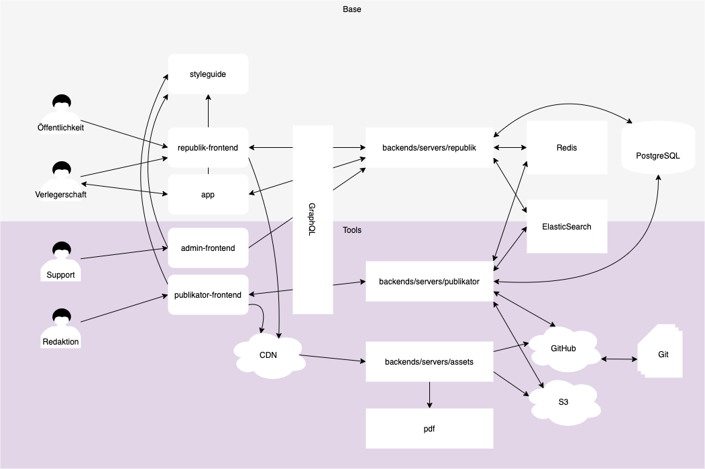

# Overview

Core principle: Everything we do is open source.

Core Tech: 
- React (declarative component framework)
- GraphQL (query language)
- Node.js (JavaScript runtime)
- Postgres (SQL database)
- Next.js (framework for react apps)
- Slate (rich text editor framework)
- Git(Hub) (hosted git with a social network)
- remark (markdown processor)

Notes

## Base

Ecommerce and Users

styleguide            postgres
republik-frontend     backends/servers/republik

## Tools

Admin, Writer & Publishing Tools

republik-admin-frontend
mdast                 Git(Hub)
publikator-frontend   backends/servers/publikator
                      backends/servers/assets
                      redis

## Next

pdf                   ElasticSearch

## The Life of an Article

(Idea and Planning outside of our system: editorial meetings, networking)

- create article
    + iterate with many versions
- production worksflow
    + tags
- publish
    + tag
    + redis
    + s3
- render
    + web
    + pdf

## Lines of Code

Stand: 26.04.2018

- stylguide 36k, initial commit 5 Mar 2017
- republik-frontend 21k, initial commit 2 Oct 2017
- publikator-frontend 19k, initial commit 24 Jul 2017
- pdf 2k, initial commit 12 Dec 2017
- backends 23k, initial commit 23 Jan 2017

Next: [How to Run](./how-to-run.md)
